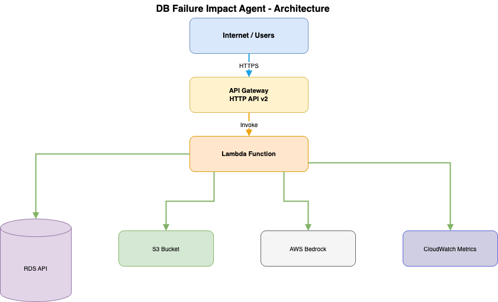

# DB Failure Impact Agent

**Analyze database failure scenarios and assess their business impact on SLAs, RTOs, and RPOs.**

## What It Does

This agent uses AI (AWS Bedrock Claude 3.5 Sonnet) to analyze how database failures affect your business objectives:

- **SLA Violations**: Will this failure breach uptime commitments?
- **RTO Assessment**: Can we recover within acceptable time windows?
- **RPO Assessment**: How much data might we lose?
- **Severity Classification**: CRITICAL, HIGH, MEDIUM, or LOW business impact

## Features

- **4 Failure Scenarios**: Primary failure, replica lag, backup failure, storage pressure
- **Single Analysis**: Analyze one database at a time
- **Batch Analysis**: Analyze up to 50 databases in parallel
- **What-If Simulation**: Test hypothetical configurations (e.g., "What if we enable Multi-AZ?")
- **CloudWatch Dashboard**: Monitor usage patterns and performance metrics

## Architecture



**High-level flow:**
Internet/Users → API Gateway → Lambda → AWS Services (RDS API, S3, Bedrock, CloudWatch)

## Quick Start

### API Usage

**Single Analysis:**
```bash
# Using a fake database (for testing)
curl -X POST https://your-api.amazonaws.com/ \
  -H "Content-Type: application/json" \
  -H "x-api-key: YOUR_API_KEY" \
  -d '{
    "db_identifier": "prod-orders-db-01",
    "scenario": "primary_db_failure"
  }'

# Or use a real RDS database identifier (must match exactly as in AWS console)
# curl -X POST https://your-api.amazonaws.com/ \
#   -H "Content-Type: application/json" \
#   -H "x-api-key: YOUR_API_KEY" \
#   -d '{
#     "db_identifier": "your-actual-rds-instance-id",
#     "scenario": "primary_db_failure"
#   }'
```

**Batch Analysis:**
```bash
# Mix of fake and real database identifiers
curl -X POST https://your-api.amazonaws.com/batch-analyze \
  -H "Content-Type: application/json" \
  -H "x-api-key: YOUR_API_KEY" \
  -d '{
    "db_identifiers": ["prod-orders-db-01", "your-actual-rds-instance-id"],
    "scenario": "primary_db_failure"
  }'
```

**What-If Simulation:**
```bash
# Test hypothetical configurations (works with fake or real databases)
curl -X POST https://your-api.amazonaws.com/what-if \
  -H "Content-Type: application/json" \
  -H "x-api-key: YOUR_API_KEY" \
  -d '{
    "db_identifier": "prod-orders-db-01",
    "scenario": "primary_db_failure",
    "config_overrides": {
      "multi_az": true,
      "backup_retention_days": 14
    }
  }'
```

### Database Identifiers

By default, the agent uses **fake databases** for testing without AWS costs. Available fake databases:
- `prod-orders-db-01` - MySQL, no Multi-AZ, 7-day backups
- `prod-users-db` - PostgreSQL, Multi-AZ enabled, PITR enabled
- `dev-analytics-db-03` - PostgreSQL, storage pressure scenario
- `prod-payments-db` - MySQL, Multi-AZ, with read replicas

To analyze **real RDS databases**, provide the exact database identifier as it appears in the AWS RDS console. The identifier must match exactly (case-sensitive). The agent will query AWS RDS to fetch the database configuration automatically.

### Response Format

```json
{
  "sla_violation": true,
  "rto_violation": false,
  "rpo_violation": false,
  "expected_outage_time_minutes": 45,
  "business_severity": "HIGH",
  "why": [
    "Multi-AZ disabled: manual promotion required (30-45 min)",
    "Backup retention 7 days: meets RPO but RTO depends on Multi-AZ"
  ],
  "recommendations": [
    "Enable Multi-AZ to reduce RTO to <5 minutes",
    "Consider read replicas for critical workloads"
  ],
  "confidence": 0.85
}
```

## Available Scenarios

- `primary_db_failure`: Primary database instance failure
- `replica_lag`: Read replica replication lag
- `backup_failure`: Automated backup failures
- `storage_pressure`: Storage capacity approaching limits

## Deployment

### Prerequisites

- AWS Account with Bedrock access
- Terraform 1.x
- Python 3.12

### Deploy Infrastructure

```bash
cd terraform
terraform init
terraform apply
```

### Build & Deploy Lambda

```bash
./build.sh
cd terraform
terraform apply  # Updates Lambda code
```

### Access Dashboard

After deployment, get the CloudWatch dashboard URL:
```bash
terraform output dashboard_url
```

## Tech Stack

- **Runtime**: AWS Lambda (Python 3.12)
- **AI/LLM**: AWS Bedrock (Claude 3.5 Sonnet)
- **API**: API Gateway v2
- **Storage**: S3 (business policies), RDS (database state)
- **Observability**: CloudWatch Custom Metrics & Dashboard
- **IaC**: Terraform

## Project Structure

```
playbook-agent/
├── src/
│   ├── engine/          # Core analysis engine
│   │   ├── reasoning.py      # LLM simulation logic
│   │   ├── scenarios.py      # Scenario registry
│   │   ├── batch_analyzer.py # Batch orchestration
│   │   └── what_if.py        # What-if simulator
│   └── infra/
│       └── lambda_handler.py # API routing
├── terraform/            # Infrastructure as Code
│   ├── main.tf
│   ├── dashboard.tf     # CloudWatch dashboard
│   └── iam.tf           # IAM roles & permissions
└── docs/                # Architecture & user stories
```

## Future Plans

Planned enhancements include automatic scanning of existing RDS databases, expansion to other AWS database services (DynamoDB, DocumentDB, etc.), and a framework for easily adding new failure scenarios.

## License

MIT

